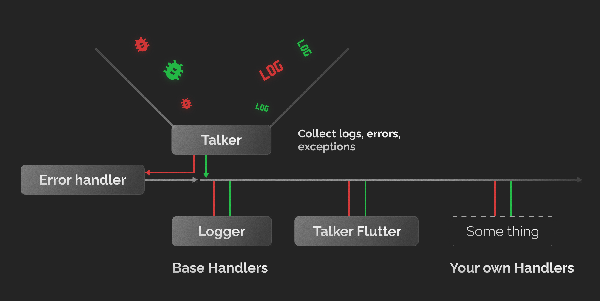
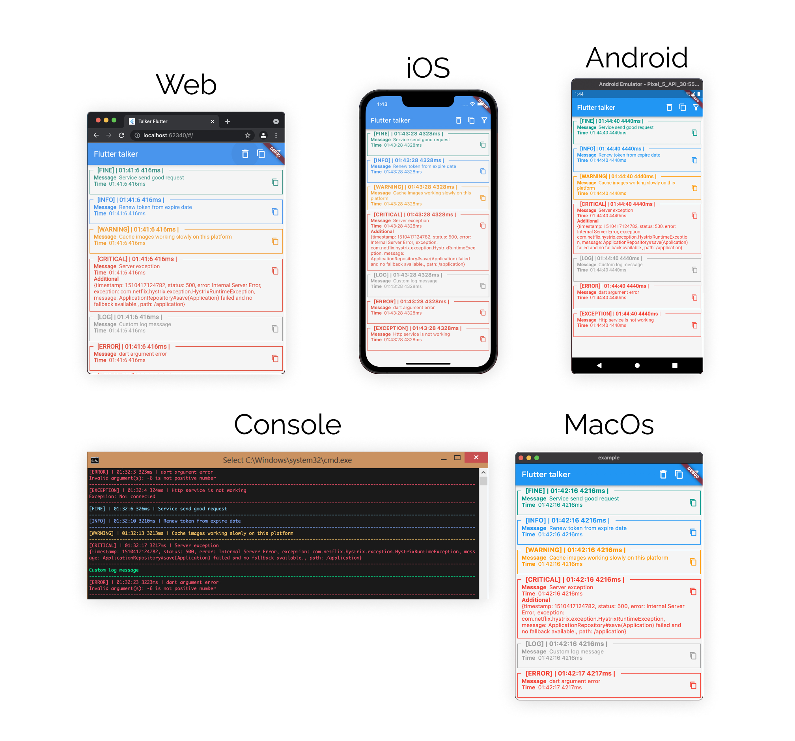

<h1 align="center">Talker</h1>
<h2 align="center"> Advanced exception handling and logging for dart/flutter applications 🚀</h2>

    Log your app actions, catch and handle your app exceptions and errors
    
    Show some ❤️ and <a href="https://github.com/Frezyx/talker">star the repo</a> to support the project! 

<h2 align="center">How it works?</h2>

  

<h2 align="center">On All Platforms</h2>

   Please add Windows and Linux screenshots😘

  

### TODO:
- LogLevel as a model with customization
- ErrorLevel as a model with customization
- Filter for logs in UI (talker_flutter)