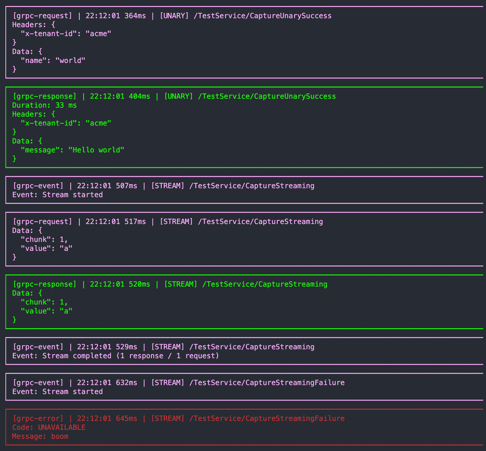

# talker_grpc_logger

Lightweight and customizable [grpc](https://pub.dev/packages/grpc) client logger on [talker](https://pub.dev/packages/talker) base.<br>
[Talker](https://github.com/Frezyx/talker) - Advanced exception handling and logging for dart/flutter applications 🚀

## Preview

This is how the logs of your grpc requests will look in the console


## Features

- Logs unary and streaming RPCs (client-, server-, and bidi-streaming).
- Captures method path, payload, metadata, duration, status code and error message.
- Obfuscates sensitive headers (`Authorization`, `Cookie`, `x-api-key`, …) via a case-insensitive `hiddenHeaders` set.
- Per-flag control over what is rendered and whether a log entry is emitted at all.
- Customizable colors via `AnsiPen`, JSON formatting via `TalkerJsonFormatter`.
- Pluggable `Talker` instance — works standalone or with `talker_flutter`'s UI.

### Getting started

Follow these steps to use this package

### Add dependency

```yaml
dependencies:
  talker_grpc_logger: ^5.1.20
```

## Usage

Create an interceptor and instrument your RPC client:

```dart
import 'package:grpc/grpc.dart';
import 'package:talker_grpc_logger/talker_grpc_logger.dart';

void main() {
  late final channel = GrpcOrGrpcWebClientChannel.toSingleEndpoint(
    host: 'localhost',
    port: 50051,
  );

  // Generate your RPC client as usual, and use the interceptor to log the
  // requests and responses.
  late final rpcClient = YourRPCClient(
    channel,
    interceptors: [
      TalkerGrpcLogger(),
    ],
  );
}
```

## Usage with Talker

Very similar to the section above — just pass a Talker instance to the
interceptor so logs land in the same stream you already render:

```dart
import 'package:grpc/grpc.dart';
import 'package:talker_flutter/talker_flutter.dart';
import 'package:talker_grpc_logger/talker_grpc_logger.dart';

void main() {
  // Not mandatory, but useful to see the grpc logs in the Talker screen.
  final talker = TalkerFlutter.init();

  // Define port and host as you see fit.
  const host = 'localhost';
  const port = 50051;

  // transportSecure needs to be true when talking to a server through TLS.
  // This can be disabled for local development.
  // GrpcOrGrpcWebClientChannel is a channel type compatible with web and
  // native. There are other channel types available for each platform.
  late final channel = GrpcOrGrpcWebClientChannel.toSingleEndpoint(
    host: host,
    port: port,
    transportSecure: host != 'localhost',
  );

  final interceptors = <ClientInterceptor>[
    TalkerGrpcLogger(talker: talker),
  ];

  late final rpcClient = YourRPCClient(channel, interceptors: interceptors);
}
```

## Streaming

Streaming RPCs are logged in three stages:

1. **Init** — a single `Stream started` entry when the call starts.
2. **Chunks** — one entry per outgoing request and one per incoming response.
3. **Completion** — a `Stream completed (<n> responses / <m> requests)`
   entry on clean finish, or a single error entry if the stream fails.

Each stage can be toggled independently:

```dart
TalkerGrpcLogger(
  settings: const TalkerGrpcLoggerSettings(
    printStreamInit: true,     // "Stream started"
    printStreamChunks: true,   // per-chunk entries
    printStreamComplete: true, // "Stream completed (N responses / M requests)"
  ),
);
```

`printStreamChunks` controls **whether the per-chunk entry is emitted at all**.
To keep the entry but drop the payload, use `printRequestData` /
`printResponseData` instead — those flags render the entry without its
`Data:` block.

The completion entry always reports both counters, regardless of
`printStreamChunks`. Turning per-chunk logging off hides the individual
`Data:` entries but does not affect the `Stream completed (N responses /
M requests)` summary — request and response counts are tracked anyway.

For long-lived or high-frequency streams, turn per-chunk logging off and keep
only the lifecycle entries:

```dart
TalkerGrpcLogger(
  settings: const TalkerGrpcLoggerSettings(
    printStreamChunks: false,
  ),
);
```

## Obfuscation

Sensitive header values are replaced with `*****` in the log output. The
matching is **case-insensitive** and the original `CallOptions.metadata` is
never mutated — obfuscation happens on a copy used only for formatting.

```dart
TalkerGrpcLogger(
  settings: const TalkerGrpcLoggerSettings(
    hiddenHeaders: {'authorization', 'cookie', 'x-api-key'},
  ),
);
```

With this configuration:

- `Authorization: Bearer abc.def` → `Authorization: *****`
- `Cookie: session=...` → `Cookie: *****`
- `x-api-key: ...` → `x-api-key: *****`
- `x-trace-id: 123` → unchanged (not in `hiddenHeaders`)

By default `hiddenHeaders` is empty, so nothing is masked. Enabling it is
strongly recommended for anything beyond local development.

> **Deprecated:** the `obfuscateToken` flag on `TalkerGrpcLogger` and
> `GrpcErrorLog` still works for backward compatibility, but it only hides a
> single hard-coded `authorization` header. Prefer `hiddenHeaders` — it
> supports arbitrary keys and is case-insensitive.

## Configuration

All behavior is driven by `TalkerGrpcLoggerSettings`. It is immutable and
`Equatable`, so instances are safe to share and cheap to derive with
`copyWith`:

```dart
const base = TalkerGrpcLoggerSettings();

final debug = base.copyWith(
  logLevel: LogLevel.debug,
  printStreamChunks: true,
);
```

| Field                   | Default                      | Purpose                                                                              |
| ----------------------- | ---------------------------- | ------------------------------------------------------------------------------------ | --- |
| `enabled`               | `true`                       | Master switch. When `false` the interceptor passes calls through untouched.          |
| `logLevel`              | `LogLevel.debug`             | Level attached to request and response logs. Error logs always use `LogLevel.error`. |
| `printRequestData`      | `true`                       | Render the request payload (`Data: {...}`) in request logs.                          |
| `printRequestHeaders`   | `true`                       | Render request metadata. Subject to `hiddenHeaders`.                                 |
| `printResponseData`     | `true`                       | Render the response payload in response logs.                                        |
| `printResponseHeaders`  | `true`                       | Render response metadata.                                                            |
| `printResponseDuration` | `true`                       | Render elapsed milliseconds for completed requests.                                  |
| `printErrorCode`        | `true`                       | Render `Code: <GRPC_STATUS>`, e.g. `UNAVAILABLE`.                                    |
| `printErrorHeaders`     | `true`                       | Render request metadata in error logs. Subject to `hiddenHeaders`.                   |
| `printErrorMessage`     | `true`                       | Render `Message: <text>` in error logs.                                              |
| `printStreamInit`       | `true`                       | Emit the `Stream started` lifecycle entry.                                           |
| `printStreamChunks`     | `true`                       | Emit one entry per stream chunk.                                                     |
| `printStreamComplete`   | `true`                       | Emit the `Stream completed (<n> responses / <m> requests)` lifecycle entry.          |     |
| `hiddenHeaders`         | `{}`                         | Case-insensitive set of header names to mask with `*****`.                           |
| `jsonFormatter`         | `TalkerJsonFormatter()`      | Formatter for payloads and headers.                                                  |
| `requestPen`            | `null` (violet `xterm(219)`) | Console color for request logs.                                                      |
| `responsePen`           | `null` (green `xterm(46)`)   | Console color for response logs.                                                     |
| `errorPen`              | `null` (red)                 | Console color for error logs.                                                        |

### Examples

Minimal, no stream chunk spam:

```dart
TalkerGrpcLogger(
  settings: const TalkerGrpcLoggerSettings(
    printStreamChunks: false,
    hiddenHeaders: {'authorization'},
  ),
);
```

Pretty JSON with quotes stripped, custom colors:

```dart
TalkerGrpcLogger(
  settings: TalkerGrpcLoggerSettings(
    jsonFormatter: const TalkerJsonFormatter(stripQuotes: true),
    requestPen: AnsiPen()..blue(),
    errorPen: AnsiPen()..magenta(),
  ),
);
```

Disable entirely (useful in release builds):

```dart
TalkerGrpcLogger(
  settings: const TalkerGrpcLoggerSettings(enabled: false),
);
```
