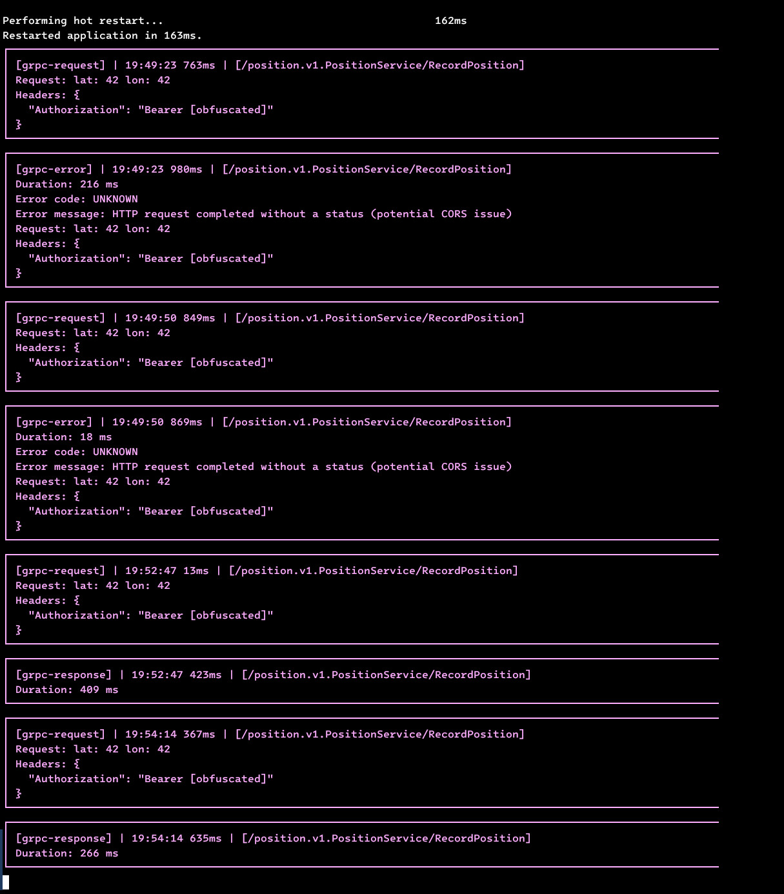

# talker_grpc_logger
Lightweight and customizable [grpc](https://pub.dev/packages/grpc) client logger on [talker](https://pub.dev/packages/talker) base.<br>
[Talker](https://github.com/Frezyx/talker) - Advanced exception handling and logging for dart/flutter applications 🚀

## Preview
This is how the logs of your grpc requests will look in the console



## Note

At the moment, only unary RPCs are supported. Streaming RPCs will probably
be added in the future. Contributions are welcome!


## Usage

Create an interceptor and instrument your RPC client:

```dart
import 'package:grpc/grpc.dart';
import 'package:grpc/grpc_or_grpcweb.dart';
import 'package:talker_flutter/talker_flutter.dart';
import 'package:talker_grpc_logger/talker_grpc_logger.dart';

void main() {
  // Define port and host as you see fit
  var host = 'localhost';
  var port = 50051;

  // transportSecure needs to be true when talking to a server through TLS.
  // This can be disabled for local development.
  // GrpcOrGrpcWebClientChannel is a channel type compatible with web and native. There
  // are other channel types available for each platform.
  late final channel = GrpcOrGrpcWebClientChannel.toSingleEndpoint(
      host: host,
      port: port,
      transportSecure: host == 'localhost' ? false : true);


  final List<ClientInterceptor> interceptors = [
    TalkerGrpcLogger()
  ];

  // Generate your RPC client as usual, and use the interceptor to log the requests and responses.
  late final rpcClient = YourRPCClient(channel, interceptors: interceptors);
}
```


## Usage with Talker

Very similar to the section above, just pass a Talker instance to the interceptor:

```dart
import 'package:grpc/grpc.dart';
import 'package:grpc/grpc_or_grpcweb.dart';
import 'package:talker_flutter/talker_flutter.dart';
import 'package:talker_grpc_logger/talker_grpc_logger.dart';

void main() {
  // Not mandatory, but useful to see the grpc logs in the Talker screen
  final talker = TalkerFlutter.init();

  // Define port and host as you see fit
  var host = 'localhost';
  var port = 50051;

  // transportSecure needs to be true when talking to a server through TLS.
  // This can be disabled for local development.
  // GrpcOrGrpcWebClientChannel is a channel type compatible with web and native. There
  // are other channel types available for each platform.
  late final channel = GrpcOrGrpcWebClientChannel.toSingleEndpoint(
      host: host,
      port: port,
      transportSecure: host == 'localhost' ? false : true);


  final List<ClientInterceptor> interceptors = [
    TalkerGrpcLogger(talker: talker)
  ];

  // Generate your RPC client as usual, and use the interceptor to log the requests and responses.
  late final rpcClient = YourRPCClient(channel, interceptors: interceptors);
}
```


## Token obfuscation

`TalkerGrpcLogger` will obfuscate bearer tokens by default. It'll look at the
metadata of the request and obfuscate the `authorization` header. It'll look
like `Bearer [obfuscated]` in the logs. It is highly recommended to keep this
option enabled. If you want to disable it, you can pass `obfuscateToken:
false`:

```dart
TalkerGrpcLogger(talker: talker, obfuscateToken: true)
```
